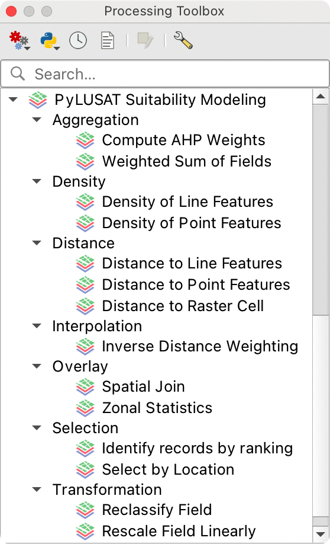
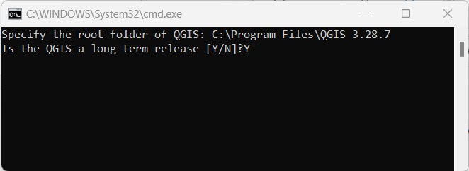
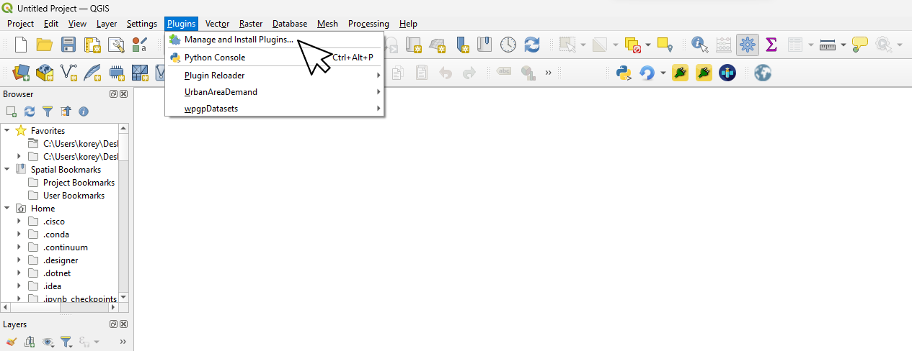
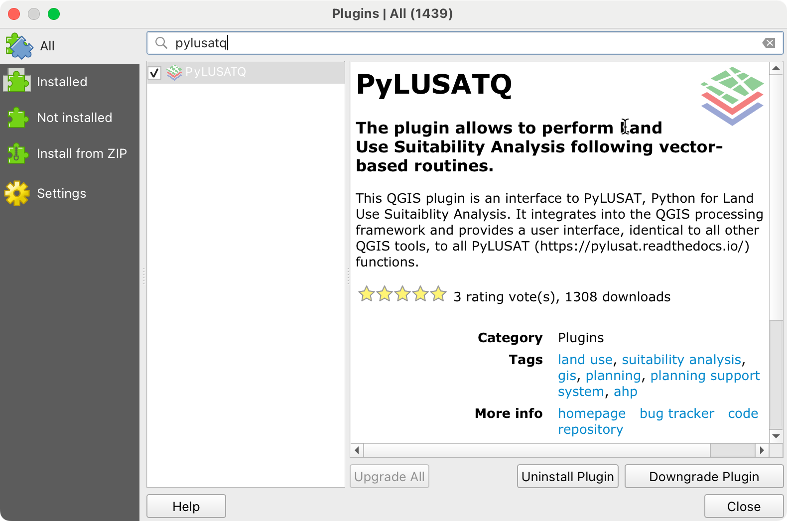

# PyLUSAT for QGIS

The **Python for Land-use Suitability Analysis Tools** (PyLUSAT) is an
open-source Python package dedicated for GIS-based land-use suitability
modeling.
This QGIS plugin provides interfaces to all functions in PyLUSAT to
allow easy access and better integration into the QGIS _processing
framework_.

For more information of PyLUSAT toolkit: https://github.com/chjch/pylusat or https://pypi.org/project/pylusat/

## Requirements

- Windows (Windows 7, Windows 10 recommended) or macOS.
- *QGIS version* 3.16 or higher (recommended).

## Installation

### 1. Set up PyLUSAT

**In Windows:**
1. We suggest two ways to set up your computer for PyLUSAT. 
   **For beginners:** <ol type="a">
      <li> Visit <a href="https://github.com/chjch/pylusat-qgis">PyLUSAT 
      GitHub repository</a>. Click <b>Code</b>, and then <b>Download ZIP</b> 
      to download the <i>pylusat-qgis</i> repository. 
      <li>Copy `pylusat_installer.bat`, paste it under QGIS folder in your 
      system. This file will install the prerequisite packages needed to use PyLUSATQ.
      <li><b>Right Click</b> the copied <i>pylusat_installer.bat</i> to 
      <b>Run as administrator</b>.
      

   </ol> 

   **OR, if you are familiar to work with terminals:** 
      Visit <a href="https://github.com/chjch/pylusat-qgis">PyLUSAT
      GitHub repository</a>.
      Copy and paste the code in *pylusat_installer.bat* to your terminal 
      under the QGIS folder and run it. 

   >**Note**: 
   >The `pylusat_installer.bat` file helps you clean your environment and
   >install proper pre-required packages. Noted that:   1. we use `pipwin`
   >instead of `pip` or `conda` considering the compatibility of QGIS and the
   >packages.  2. we apply `pipwin refresh` to force a cache rebuild in case
   >any potential conflicts.  For more information about the PyLUSAT
   >plugin, please visit https://github.com/chjch/pylusat.

2. In the pop-up window:
   
   

   <ol type="a">
      <li><b>Specify your root folder of QGIS</b>:The same where you place the installer.

      -  For example C:\Program Files\QGIS 3.29.7

      <li><b>Is the QGIS a long term release [Y/N]</b>:
      Refer to the version you installed. Type <b>Y</b> for long term release.
      <b>N</b> for short term release.</li>

      -  The easiest way to identify this is by Opening QGIS and seeing if there is a banner on the splash screen labeling it as a long term release. 

   </ol>
3. Press **Enter** key and wait for the installation to complete.

**In macOS:**
Use `pip install pylusat` in Python Command Prompt of **QGIS**.

### 2. Install PyLUSATQ plugin

- Go to **Plugins** -> **Manage and Install Plugins**.

- In the **Search** bar, type **PyLUSATQ** (be sure to CHECK **Show also experimental plugins** in the **Settings**).
- Click **Install Experimental Plugin** to install PyLUSATQ.
- Wait for a **Plugin Installed Successfully** Pop-Up
- Close the QGIS application and re-open it to force a refresh of the installed plugins
- In the processing toolbar search for the PyLUSATQ icon and dropdown
