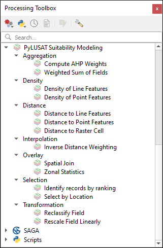

# PyLUSAT for QGIS

The Python for Land-use Suitability Analysis Tools (PyLUSAT) is an open-source
Python package dedicated for GIS-based land-use suitability modeling.
This QGIS plugin provides interfaces to all functions in PyLUSAT to allow
easy access and better integration into the QGIS _processing framework_.

